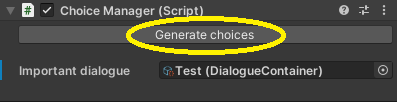

## Poprawne ustawienie NPC

Aby z dowolnym obiektem w grze (np. NPC) można było porozmawiać, należy upewnić się, że ma on przypisane w inspectorze dwa skrypty: **LoadDialogue.cs** (odpowiedzialny za wczytanie dialogu oraz jego wyświetlanie) i **DialogueInteraction.cs** (odpowiedzialny za system interakcji z postaciami, obsługę eventów systemu dialogowego itd.)

Omówmy teraz pokrótce składowe tych skryptów, które można dostosować.

**Name Of NPC:** nazwa (imię) NPC, która będzie wyświetlane w panelu dialogowym

**Current Dialogue ID:** ID dialogu, który obecnie będzie wczytany. Wartość tej zmiennej jest równa indeksowi wybranego dialogu w liście **Dialogues**

**Dialogues:** lista wszystkich dialogów, w które możemy wejść z daną postacią. Jeśli chcemy odtworzyć konkretny dialog, dodajemy go do tej listy, a następnie ustawiamy **Current Dialogue ID** na indeks dodanego do listy dialogu

**Interaction Distance:** Z jakiej odległości (maksymalnie) możemy prowadzić rozmowę z NPC (jeśli będziemy dalej – interakcja nie zostanie przeprowadzona)

**[Add hints]:** Przycisk pozwalający dodać wskazówki z systemu wskazówek w rogu ekranu i przy celowniku

**[Add player position or rotation]:** Przycisk, który dodaje opcje z systemu manipulacji graczem. Pozwala to na przemieszczenie gracza w określone miejsce podczas dialogu z NPC oraz sprawienie, że gracz będzie się patrzył w określonym kierunku (np. zawsze na NPC).

:::tip
 Dobrym podejściem jest wybranie odpowiednich parametrów oraz zapisanie ich do prefaba, dzięki czemu możliwe będzie tworzenie jednakowych NPC o najbardziej trafnych ustawieniach
:::

## Graf dialogowy oraz DialogueContainer

Dialogi w Susteny tworzone są przez tzw. graf dialogów. Jest on odpowiedzialny za rozgałęzianie się dialogów, określanie, w którym momencie możemy dialog opuścić, co wypowiada gracz, oraz które opcje dialogowe prowadzą do jego zakończenia.

Sam **Narrative graph** nie jest jednak „silnikiem&quot; dialogów, a ich edytorem. Dialogi przetwarzają skrypty **LoadDialogue.cs** i **DialogueInteraction.cs** i operują na obiektach będącymi produktami grafu dialogowego. Są to scriptable objecty typu **DialogueContainer**.

:::caution
 Edycji obiektów dialogów nie zaleca się dokonywać przez inspector Unity, ale przez Narrative Graph. Jeśli modyfikujesz ręcznie ten scriptable object, upewnij się, że wiesz, co robisz
:::

Graf dialogowy otwieramy z następującego okna:

Omówmy teraz szczegółowo graf:

1. Nazwa scriptable objectu, do którego zapisujemy (z którego wczytujemy) dialog
2. Przycisk, który zapisuje dane z grafu do scriptable objectu
3. Przycisk, który wczytuje dane ze scriptable objectu do grafu
4. Jeżeli ta opcja jest zaznaczona, to dialog będzie można opuścić w każdym momencie przy pomocy przycisku „Zakończ&quot; w rogu ekranu. Warto pozostawić tę opcję zaznaczoną w przypadku opcjonalnych, mniej istotnych dialogów. **Nigdy nie powinna ona być zaznaczona w przypadku znaczących dialogów fabularnych, które gracz obowiązkowo musi przeprowadzić**
5. Przestrzeń grafu – działa na bazie Unity GraphView – można po niej zaznaczać, wykorzystywać prawy przycisk myszy oraz przeciągać po tej przestrzeni elementy grafu
6. Startowy node reprezentujący początek dialogu
7. Połączenie pomiędzy node&#39;ami wskazujące na przejście z jednej kwestii dialogowej do drugiej. Reprezentowane przez typ danych NodeLinkData
8. Komórka dialogu
   1. Tę opcję należy zaznaczyć, jeśli ten node ma kończyć dialog (jeśli jest to opcja „wyjścia&quot;)
   2. Tę opcję należy zaznaczyć, jeśli (wyjątkowo) zawartość tego node&#39;a ma być wypowiedziana z ust gracza (np. jako kontynuacja wcześniej wypowiedzianej kwestii)
   3. Pole tekstowe zawierające treść dialogu, który wypowiada NPC
   4. [opcjonalnie] Alternatywny tekst dla NPC – zostaje wyświetlony zamiast głównej opcji dialogowej ( **8.3** ) gdy trafimy na daną opcję ponownie. Eliminuje to absurdalne sytuacje, że postać wita się z nami w nieskończoność, gdy wybieramy ciągle tę samą opcję dialogową. Jeśli nie chcesz, żeby NPC wypowiadał alternatywny dialog, zostaw to pole puste lub wyczyść je przyciskiem ( **8.9** )
   5. Przycisk usuwający dodaną opcję dialogową gracza
   6. Jeśli ta opcja jest zaznaczona (domyślnie zawsze tak), to po powrocie do tego node&#39;a, jeśli wcześniej wybraliśmy tę opcję, będzie ona wyszarzona. Zaleca się pozostawienie tej opcji włączonej. Zmień ją na „false&quot; tylko w szczególnych przypadkach, jeśli wiesz, co robisz
   7. Pole tekstowe zawierające treść opcji dialogowej, którą może wybrać gracz. Takie pole dodaje się przyciskiem ( **8.8** )
   8. Przycisk dodający opcję dialogową, którą może wybrać gracz
   9. Przycisk usuwający treść alternatywnego tekstu NPC
9. Komórka kończąca dialog (pokazana jako przykład – jeśli chcesz, żeby jakaś opcja kończyła dialog, połącz ją właśnie z taką komórką, która ma zaznaczoną opcję **8.1** )
10. Minimapa pozwalająca na podgląd całokształtu grafu
11. Tablica – **NIEUŻYWANA** , niedokończona część pierwotnego package&#39;a dialogowego. **Ignorować, nie wchodzić z nią w interakcje.** Może zostać (najprawdopodobniej) usunięta lub rozwinięta w przyszłości

Na koniec edycji dialogu należy nazwać plik (już istniejącą nazwą, aby nadpisać lub nową, aby stworzyć nowy dialog) i zapisać go przyciskiem **2**.

Zapisany dialog (zapisują się one w folderze Resources/Dialogues) przenosimy do komórki w liście **Dialogues** w skrypcie **LoadDialogue.cs** u określonego NPC. Jeżeli zmienna **Current Dialogue ID** będzie równa indeksowi tego dialogu (możesz to oczywiście zmieniać dynamicznie podczas gry!), na ekranie podczas interakcji z postacią zobaczysz swój nowo stworzony dialog. Gotowe!

## Konsekwencje wyborów dokonanych w dialogach

Susteny umożliwia także wywoływanie funkcji za pomocą wybrania konkretnej opcji dialogowej. W ten sposób, w zależności od tego, jak potoczył się dialog, możemy np. dodać do dziennika postaci określony wpis lub po prostu zapisać wybór gracza do **systemu śledzącego konsekwencje wyborów** , aby zmienić bieg fabuły.

W folderze **Assets/3.PREFABS** odnajdujemy prefab **Choice** i przenosimy go na scenę. Nie ma znaczenia, jakie miejsce będzie on zajmował w hierarchii, jednak warto np. utworzyć pusty gameobject będący kontenerem na wszystkie wybory.

**Obowiązuje następująca zasada:** jeden gameobject **Choice** reprezentuje konsekwencje opcji tylko w jednym dialogu. Oznacza to, że każdy dialog, który ma być znaczący (ma mieć swoje konsekwencje) musi mieć odpowiadający mu gameobject **Choice**. Warto więc rozróżnić je z nazwy

**Choice** zawiera skrypt **ChoiceManager.cs** obsługiwany przez customowy edytor. Aby stworzyć konsekwencje opcji dialogowych wybranych przez gracza, **wybieramy, jaki dialog ma mieć konsekwencje**.

Po wybraniu dialogu ukaże się przycisk **[Generate choices]** – wciskamy go, aby wyświetlić opcje dialogowe.

Wygenerowana zostanie lista wszystkich opcji, jakie może wybrać gracz (jeden element listy odpowiada jednemu wyborowi). Omówmy składowe elementu listy.

**Choice ():** UnityEvent – w tym miejscu przypisujemy funkcję, która ma zostać wywołana po wybraniu dialogu

**Option Text:** Treść opcji dialogowej – pozwala na identyfikację konkretnego wyboru.
:::danger
 Jest to edytowalne pole tekstowe. **Nigdy jednak nie wolno go edytować!** – jest to pole tekstowe wyświetlone „na sucho&quot; ze względu na konstrukcję typu danych ze skryptu **ChoiceManager.cs**
:::

**Base GUID:** GUID node&#39;a, na którym zamieszczona jest ta opcja dialogowa – pozwala na identyfikację konkretnego wyboru (zwłaszcza gdy w dialogu jest kilka opcji o tej samej treści). 
:::danger
 Jest to edytowalne pole tekstowe. **Nigdy jednak nie wolno go edytować!** – jest to pole tekstowe wyświetlone „na sucho&quot; ze względu na konstrukcję typu danych ze skryptu **ChoiceManager.cs**
:::

Przypisujemy obiekt, po czym wywołujemy na nim funkcję poprzez UnityEvent. Powyżej pokazano przykład. Zostawiamy ustawiony gameobject **Choice** na scenie. Przy następnym wybraniu opcji dialogowej, do której przypisano funkcję – zostanie ona wywołana. Działa to również po zbuildowaniu gry. Jeżeli chcemy, aby opcje z innego dialogu niosły konsekwencje – dodajemy na scenę nowy gameobject **Choice** i powtarzamy proces.

## Przechowywanie decyzji gracza

Dla zachowania porządku w projekcie – podjęte przez gracza decyzje (zarówno te z dialogów, jak i wywołane poprzez inne działania) powinny być przechowywane w jednym miejscu. Jest to gameobject **GameManager** oraz skrypt **SavedDecisions.cs**.

Skrypt **SavedDecisions.cs** zawiera istotne booleany będące reprezentacją decyzji gracza. Można się do niego dostać po tagu **GameManagera** oraz pobraniu komponentu **SavedDecisions.cs**.

:::info
 Demo przeznaczone na ZTGK będzie trwało 15 – 20 min. Oznacza to, że przejście go będzie się odbywało podczas jednej sesji. W takim wypadku nie ma sensu tworzyć systemu zapisu gry, a co za tym idzie, zapisu opcji wybranych przez gracza. Skrypt **SavedDecisions.cs** jedynie przechowuje wartości istotnych zmiennych w pamięci. **W przypadku rozbudowy i kontynuacji projektu należy uwzględnić, że zawartość skryptu SavedDecisions.cs musi być zapisywana do pliku przy zapisie gry**.
:::