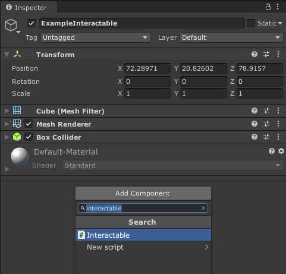
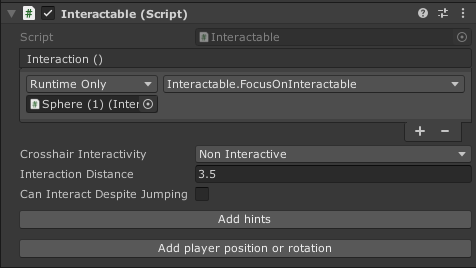
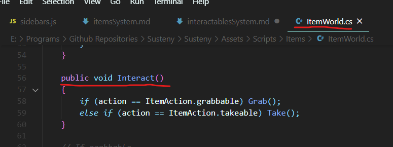
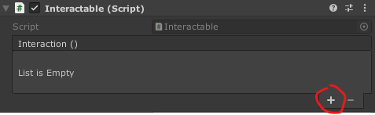
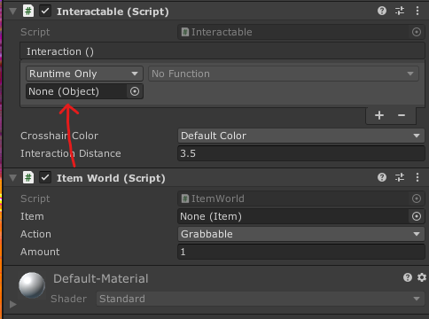
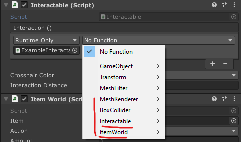

## Wstęp

Na tej stronie opisany jest proces tworzenia **elementów interaktywnych**.  
Są to elementy, które reagują na kliknięcie za pomocą myszki. Po kliknięciu myszką wykonana może zostać customowa funkcja. Stąd możliwości są nieograniczone: może włączyć się specjalny tryb inspekcji przedmiotu, tryb w którym gracz może przesuwać myszką różne obiekty, kręcić nimi, jakikolwiek tryb, który stworzy programista. System oraz skrypty opisywane na tej stronie odpowiadają za samo rozpoczęcie takiej interakcji oraz za różne dodatkowe opcje z tym związane.

:::note
Interaktywność jest niezbędna, jeżeli chcemy aby przedmiot (zobacz: [Tworzenie przedmiotów](items)) umieszczony w świecie gry mógł zostać podniesiony przez gracza.
:::

## 1. Stworzenie obiektu

Należy stworzyć obiekt na scenie lub przenieść prefab, który ma już np. odpowiedni model.

## 2. Dodanie do obiektu skryptu Interactable

Przenosimy skrypt z folderu lub używamy opcji Add Component i wyszukujemy Interactable.

### Skrypt interactable oraz jego opcje

Skrypt Interactable pozwala na skonfigurowanie pewnych własności obiektu, takich jak:
- Crosshair Interactivity - określa czy kursor oraz podpowiedź przy kursorze będą widoczne gdy gracz najedzie na dany przedmiot myszką.
  - interactive, jeżeli jesteśmy wystarczająco blisko kursor oraz podpowiedź pojawią się
  - non interactive, kursor zawsze będzie nieinteraktywny (co nie oznacza, że nie będziemy mogli wejść w interakcję z przedmiotem!)
- Interaction distance - określa z jak daleka gracz będzie mógł wejść w interakcję z danym obiektem.
- Can interact despite jumping - czy gracz może zapoczątkować interakcję podczas skoku
- Przycisk "Add/Remove hints", odpowiada za dodanie / usunięcie skryptu z podpowiedziami 
- Przycisk "Add/Remove player position or rotation" dodający / usuwający skrypt, dzięki któremu można określić w jakiej pozycji ma stać gracz podczas interakcji (gracz uda się na określoną pozycję)

## 3. Dodanie customowego skryptu

Musimy dodać do obiektu skrypt, który będzie odpowiedzialny za konkretne działanie przedmiotu wykonane **po kliknięciu na niego przez gracza**.

Uważny obesrwator być może zauważył, że ponad opcjami znajdującymi się w skrypcie Interactable, znajduje się również coś o nazwie Interaction (), pod którym widzimy komunikat "List is Empty". Jest to **UnityEvent** ([Dokumentacja Unity](https://docs.unity3d.com/Manual/UnityEvents.html)), taki sam jaki spotykamy np. podczas tworzenia przycisków do UI.

To właśnie do niego przypisujemy funkcję, która zostanie wywołana po kliknięciu na obiekt przez gracza (jeżeli spełnione są określone wymagania (np. gracz nie wykonuje innej akcji, gracz jest w interaction distance), tym wszystkim zajmuje się skrypt Interactable).

Kilka skryptów z odpowiednimi zachowaniami znajduje się już w assetach, jak np. ItemWorld, dzięki któremu można podnosić, oglądać oraz brać przedmioty do ekwipunku.
Jeżeli w assetach nie ma skryptu, który posiadałby pożądane przez nas zachowanie, musimy stworzyć taki skrypt sami.

### Tworzenie customowego skryptu

Tworząc taki skrypt, głównym wymaganiem jest stworzenie **publicznej** funkcji, która będzie wywołana po kliknięciu na obiekt. Nazwa jest dowolna, **jednak zaleca się używanie jednej ustalonej, aby uprościć życie innym designerom. Zalecam więc nazwę "Interact".**

Drugim wymaganiem jest wywołanie funkcji StoppedInteracting znajdującej się w skrypcie Interactable. Możemy wywołać tę funkcję w jakiejkolwiek innej funkcji, w dowolnie wybranym przez nas czasie, nie ma tu żadnych limitów. Jednak powinna zostać wywołana w momencie, w którym gracz przestaje być w interakcji z obiektem.  Konieczność wywołania takiej funkcji wynika z tego, że chcemy mieć możliwość powiedzenia, czy gracz obecnie jest w interakcji z danym przedmiotem.
W skrypcie Interactable znajduje się więc <Colr color="#1877F2">bool isInteractedWith</Colr>, a w skrypcie PlayerActions <Colr color="#1877F2">GameObject interactingObject</Colr>.

## 4. Przypisanie funkcji do UnityEventu

Po dodaniu customowego skryptu lub gdy chcemy skorzystać z wbudowanych funkcji w skrypcie Interactable należy przypisać te funkcje do UnityEventu.
Aby to zrobić klikamy "+" przy liście.

W miejsce "None (Object)" musimy przenieść obiekt na scenie, który właśnie edytujemy. Najszybszą drogą będzie przeniesienie wcześniej dodanego do obiektu skryptu, w tym przypadku ItemWorld:

Można też przenieść sam skrypt Interactable, lub cokolwiek innego znajdującego się na naszym obiekcie:

Nie ma to znaczenia ponieważ później, klikając w "No function" i wybierając funkcję, widzimy wszystkie skrypty znajdujące się na naszym obiekcie:

Wybieramy więc odpowiedni skrypt, a następnie odpowiednią funkcję. Niestety w podmenu widzimy wszystkie publiczne funkcje danego skryptu, dlatego tak ważne jest aby utrzymać jedną konwencję nazewniczą dla funkcji, która będzie wykonywana po kliknęciu na obiekt przez gracza:

Element interaktywny powinien już działać.

export const Colr = ({children, color}) => (
  
    {children}
  
);