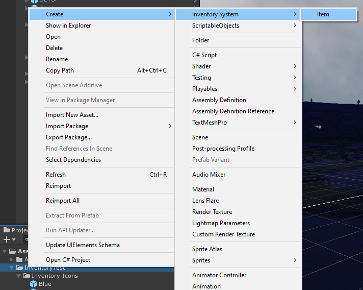
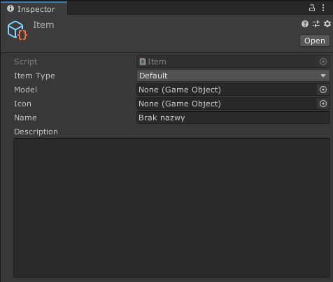
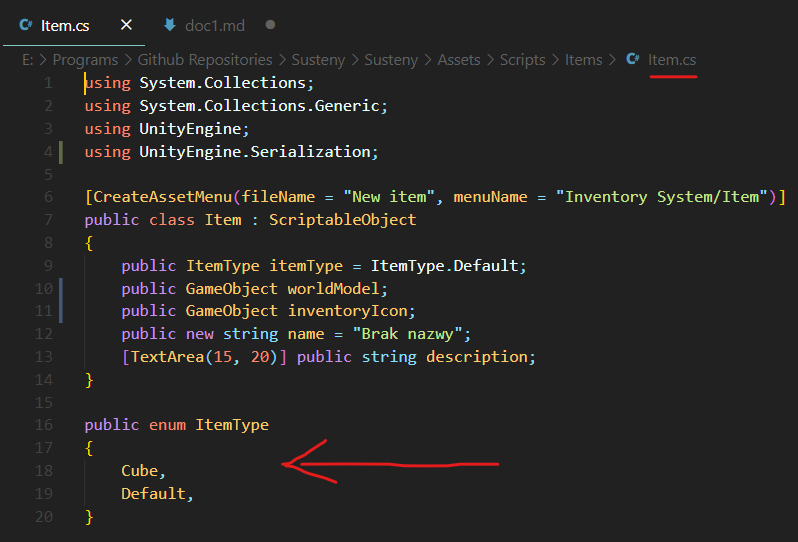
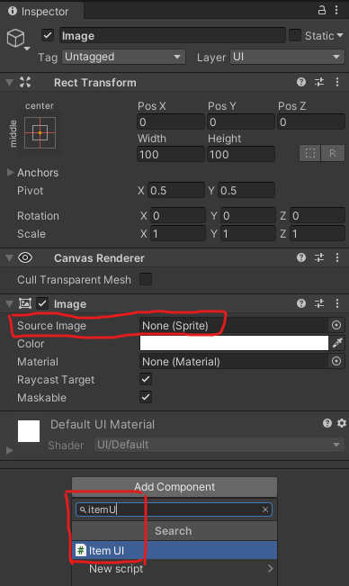

Na tej stronie opisany jest proces tworzenia **przedmiotów**, czyli obiektów, których głównym wyróżnikiem jest możliwość przechowywania w ekwipunku. Gracz może też je wtedy obejrzeć w inspektorze 3D. Posiadanie jakiegoś przedmiotu może pozwolić graczowi na wykonanie jakiejś wcześniej zablokowanej czynności (np. posiadanie klucza umożliwi otworzenie konkretnych drzwi).

Jeżeli twoim celem jest jedynie stworzenie obiektów, z którymi gracz będzie wchodził w interakcję, *w świecie gry*, i nie będzie ich przenosił w ekwipunku, może bardziej zainteresuje cię: [Tworzenie elementów interaktywnych](interactables)

Tworzymy specjalny Scriptable Object w assetach (najlepiej w odpowiednim folderze). Można to zrobić klikając prawym przyciskiem myszki na folderze -> Create -> Inventory system -> Item

Utworzy nam to bazę pod przedmiot.
Asset nazywamy jak chcemy, nazwa ta nie będzie widoczna w grze.

Teraz musimy uzupełnić informacje o przedmiocie:

1. Item type - służy do identyfikacji itemu w kodzie.

Np. gdy potrzebujemy określonego klucza do drzwi, które znajdują się w piwnicy, można dodać ItemType "**BasementKey**", a następnie sprawdzić, czy gracz posiada przedmiot o takim typie.

Aby dodać nowy typ, trzeba ręcznie dodać go w skrypcie Item, w enumie ItemType:

:::note
Jest to dość nieefektywny sposób na identyfikację przedmiotów (trzeba ręcznie dodawać nowe typy w kodzie, typy są globalne dla wszystkich leveli itd.) dlatego najprawdopodobniej system ten zostanie zmieniony.
:::

2. Kolejną rzeczą do uzupełnienia jest World Model. Jest to model przedmiotu oglądanego z ekwipunku gracza. Aktualnie nie powinien mieć on żadnych dodatkowych skryptów (w szczególności ItemWorld lub Interactable!), ma to być prosty model 3D. Jeżeli zdecydujemy się żeby gracz mógł wykonywać różne interakcje podczas oglądania przedmiotu (np. wysunięcie czegoś, starcie zdrapki itp.) to dodatkowe skrypty oczywiście będą potrzebne.

:::warning
Nie jest to ten sam model przedmiotu, który oglądamy **podnosząc** przedmiot w świecie gry! Być może ulegnie to zmianie (np. gdy wprowadzimy dodatkowe interakcje podczas oglądania przedmiotu), ale na razie nie jest to zaplanowane (gdybyśmy jednak postanowili to zrobić, World Model prawdopodobnie byłby używany w obu przypadkach, tzn. oglądając przedmiot w świecie gry, jak i oglądając go z ekwipunku).
:::

3. Inventory icon - mówi samo za siebie, jest to ikonka przedmiotu, która pojawia się gdy gracz przegląda ekwipunek.

Potrzebna nam będzie tekstura, która będzie wyświetlana jako ikonka przedmiotu, czyli po prostu jakiś plik np. png. Po zaimportowaniu go do Unity, **trzeba zmienić jego Texture Type na Sprite (2D and UI)**. Następnie na scenie należy utworzyć obiekt typu Image (prawy przycisk myszy -> UI -> Image, automatycznie zostanie on dodany do canvasu, lub jeżeli nie ma takiego na scenie, utworzy go).

- Wybrać odpowiednią teksturę w miejscu Source Image
- Dodać do niego skrypt ItemUI
- Przenieść nasz obiekt ze sceny do assetów i stworzyć z niego prefab, a następnie umieścić prefab w Inventory Icon naszego przedmiotu

4. Name, Description - nazwa oraz opis przedmiotu.
Na razie nie są one pokazywane nigdzie w grze, docelowo będą się wyświetlały w ekwipunku.

Przedmiot, który właśnie stworzyliśmy, może zostać dodany do ekwipunku gracza jedynie z poziomu kodu.
Aby umieścić nasz przedmiot na scenie, czyli aby mógł być on podnoszony oraz oglądany, należy stworzyć tak zwany element interaktywny.

Instrukcje jak to zrobić znajdują się tutaj: [Tworzenie elementów interaktywnych](interactables)