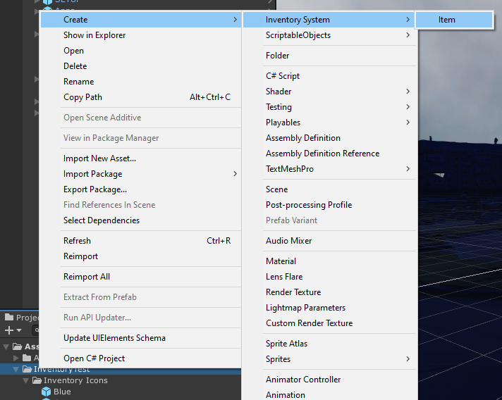
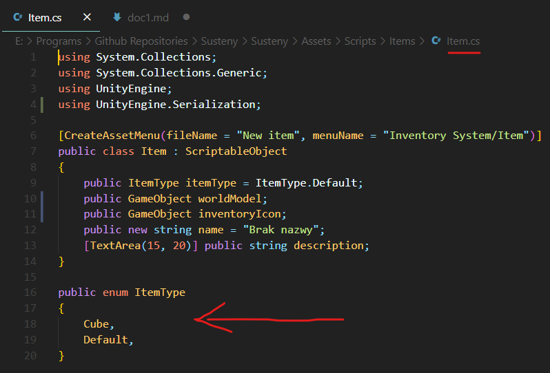
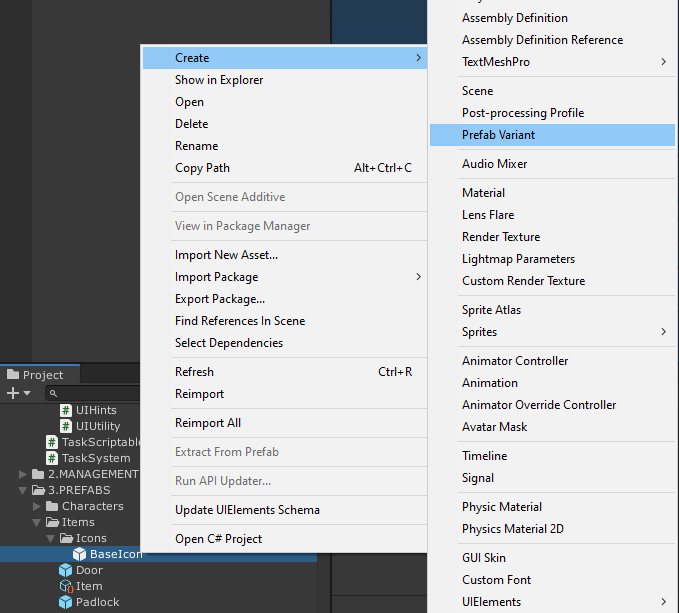

## Wstęp

Na tej stronie opisany jest proces tworzenia **przedmiotów**, czyli obiektów, których głównym wyróżnikiem jest możliwość przechowywania w ekwipunku. Gracz może też obejrzeć ich model 3D. Posiadanie konkretnego przedmiotu może pozwolić graczowi na wykonanie jakiejś wcześniej zablokowanej czynności (np. posiadanie klucza umożliwi otworzenie konkretnych drzwi).

Jeżeli twoim celem jest jedynie stworzenie obiektów, z którymi gracz będzie wchodził w interakcję *w świecie gry*, i nie będzie ich przenosił w ekwipunku, może bardziej zainteresuje cię: [Tworzenie elementów interaktywnych](interactables)

## 1. Stworzenie scriptable objectu 

Tworzymy specjalny Scriptable Object w assetach (najlepiej w odpowiednim folderze). Można to zrobić klikając prawym przyciskiem myszki na folderze -> Create -> Inventory system -> Item

Utworzy nam to bazę pod przedmiot.
Asset nazywamy jak chcemy, nazwa ta nie będzie widoczna w grze.

## 2. Ustawienie własności przedmiotu
Teraz musimy uzupełnić informacje o przedmiocie:

### Item type

Służy do identyfikacji itemu w kodzie. Np. gdy potrzebujemy określonego klucza do drzwi, które znajdują się w piwnicy, można dodać ItemType "**BasementKey**", a następnie sprawdzić, czy gracz posiada przedmiot o takim typie.

Aby dodać nowy typ, trzeba ręcznie dodać go w skrypcie Item, w enumie ItemType:

:::note
Jest to dość nieefektywny sposób na identyfikację przedmiotów (trzeba ręcznie dodawać nowe typy w kodzie, typy są globalne dla wszystkich leveli itd.) dlatego najprawdopodobniej system ten zostanie zmieniony.
:::

### Model

Jest to model przedmiotu, który będzie oglądał gracz za pomocą inspekcji włączanej z ekwipunku. Aktualnie nie powinien mieć on żadnych dodatkowych skryptów (w szczególności ItemWorld lub Interactable!), ma to być prosty model 3D. Jeżeli zdecydujemy się żeby gracz mógł wykonywać różne interakcje podczas oglądania przedmiotu (np. wysunięcie czegoś, starcie zdrapki itp.) to dodatkowe skrypty oczywiście będą potrzebne.

:::warning
Nie jest to ten sam model przedmiotu, który oglądamy **podnosząc** przedmiot w świecie gry! Być może ulegnie to zmianie (np. gdy wprowadzimy dodatkowe interakcje podczas oglądania przedmiotu), ale na razie nie jest to zaplanowane (gdybyśmy jednak postanowili to zrobić, ten model prawdopodobnie byłby używany w obu przypadkach, tzn. oglądając przedmiot w świecie gry, jak i oglądając go z ekwipunku).
:::

### Icon

Ikonka przedmiotu, którą widzi gracz przeglądając ekwipunek.

Potrzebna nam będzie tekstura, która będzie wyświetlana jako ikonka przedmiotu, czyli po prostu    jakiś plik np. png. Po zaimportowaniu go do Unity, **trzeba zmienić jego Texture Type na Sprite (2D and UI)**.

W tym momencie są dwie opcje:
- łatwiejsza i lepsza na przyszłość to stworzenie wariantu prefabu bazowej ikonki

- trudniejsza, dłuższa i być może mniej przyszłościowa (zmieniając bazową ikonkę, możemy zedytować wszystkie jej warianty jednocześnie) to manualne stworzenie ikonki

Opiszę teraz jak to zrobić:

Na scenie należy utworzyć obiekt typu Image* (prawy przycisk myszy -> UI -> Image, automatycznie zostanie on dodany do canvasu, lub jeżeli nie ma żadnego na scenie, to go utworzy).

**Nie musi to być konkretnie typ Image, wystarczy, że będzie to jakiś element UI wykorzystujący Rect Transform, jednak zalecany jest typ Image.*

- Wybrać odpowiednią teksturę w miejscu Source Image
- Dodać do niego skrypt ItemUI
- Przenieść nasz obiekt ze sceny do assetów i stworzyć z niego prefab, a następnie umieścić prefab    w zmiennej **Icon** naszego przedmiotu

### Name, Description
Nazwa oraz opis przedmiotu, które pokazują się w ekwipunku.

## Ostatnie uwagi

Przedmiot, który właśnie stworzyliśmy, może zostać dodany do ekwipunku gracza jedynie z poziomu kodu.
Aby umieścić nasz przedmiot na scenie, czyli aby mógł być on podnoszony oraz oglądany, należy stworzyć tak zwany element interaktywny, a następnie dodać do obiektu skrypt **ItemWorld** i odpowiednio skonfigurować.

Instrukcje jak to zrobić znajdują się tutaj: [Tworzenie elementów interaktywnych](interactables)