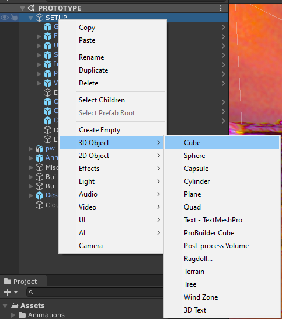
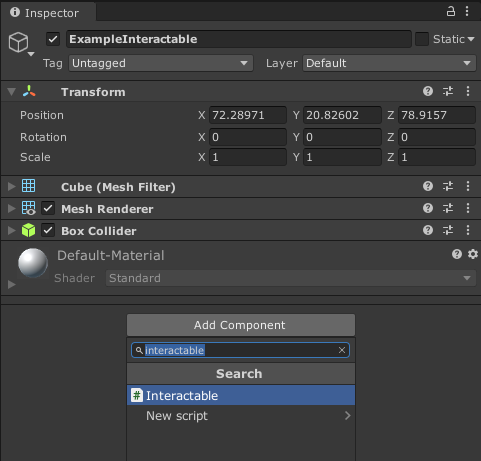
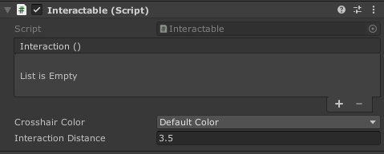
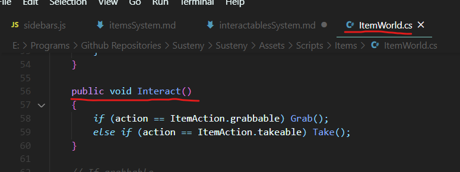
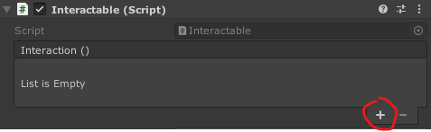
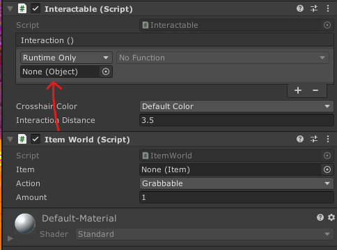
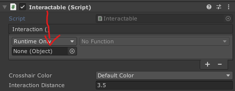
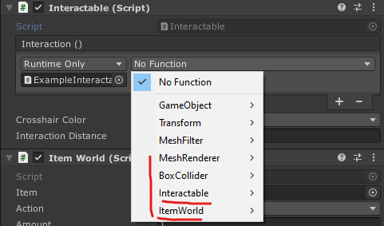
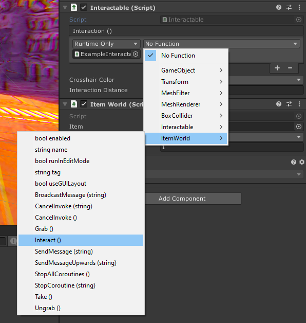

Na tej stronie opisany jest proces tworzenia elementów interaktywnych. Są to takie elementy, które mogą w różny sposób reagować, po tym jak gracz na nie kliknie.

Element taki jest potrzebny, jeżeli chcemy aby jakiś przedmiot (item) dało się umieścić w świecie gry i aby gracz mógł wziąć go do ekwipunku. 

1. Tworzymy obiekt na scenie lub przenosimy prefab, który ma już np. odpowiedni model przedmiotu.

2. Dodajemy do niego skrypt Interactable.

Jak widać mamy tutaj kilka opcji:
- Crosshair color - określa jaki kolor będzie miał kursor, gdy gracz najedzie na dany przedmiot.
- Interaction distance - określa z jak daleka gracz będzie mógł wejść w interakcję z danym obiektem.

3. Następnie musimy dodać do obiektu skrypt, który będzie odpowiedzialny za konkretne działanie przedmiotu, wykonane *po kliknięciu na niego przez gracza*.

Uważny obesrwator być może zauważył, że ponad opcjami znajdującymi się w skrypcie Interactable, znajduje się również coś o nazwie Interaction (). Pod którym widzimy komunikat "List is Empty". Jest to miejsce, a konkretniej mówiąc, **UnityEvent**, taki sam jaki spotkamy np. podczas tworzenia przycisków do UI.

 Przypiszemy do niego funkcję, która zostanie wywołana po kliknięciu na obiekt przez gracza (jeżeli spełnione są określone wymagania (np. gracz nie wykonuje innej akcji), tym wszystkim zajmuje się skrypt Interactable).

Kilka skryptów z odpowiednimi zachowaniami znajduje się już w assetach, jak np. ItemWorld, dzięki któremu można podnosić, oglądać oraz brać przedmioty do ekwipunku.
Jeżeli w assetach nie ma skryptu, który posiadałby pożądane przez nas zachowanie, musimy stworzyć taki skrypt sami.

Tworząc taki skrypt jedynym wymaganiem jest stworzenie **publicznej** funkcji, która będzie wywołana po kliknięciu na obiekt. Nazwa jest dowolna, **jednak zaleca się używanie jednej ustalonej, aby uprościć życie innym designerom. W naszym przypadku jest to "Interact".**

4. Po tym jak dodaliśmy już istniejący wcześniej skrypt, lub stworzyliśmy własny, musimy przypisać odpowiednią funkcję do UnityEventu.

Aby to zrobić klikamy "+" przy liście.

W miejsce "None (Object)" musimy przenieść obiekt na scenie, który właśnie edytujemy. Najszybszą drogą będzie przeniesienie wcześniej dodanego skryptu, w tym przypadku ItemWorld:

Można też przenieść sam skrypt Interactable, lub cokolwiek innego znajdującego się na naszym obiekcie:

Nie ma to znaczenia ponieważ później, klikając w "No function" i wybierając funkcję, widzimy wszystkie skrypty znajdujące się na naszym obiekcie:

5. Wybieramy więc odpowiedni skrypt, a następnie odpowiednią funkcję. Niestety w podmenu widzimy wszystkie publiczne funkcje danego skryptu, dlatego tak ważne jest aby utrzymać jedną konwencję nazewniczą dla funkcji, która będzie wykonywana po kliknęciu na obiekt przez gracza:

