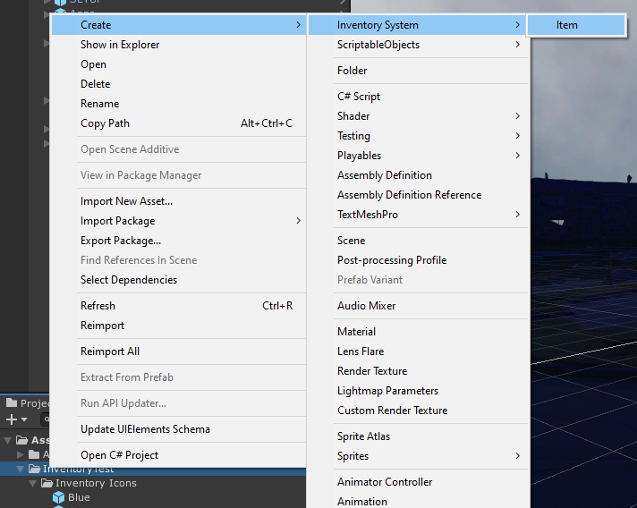
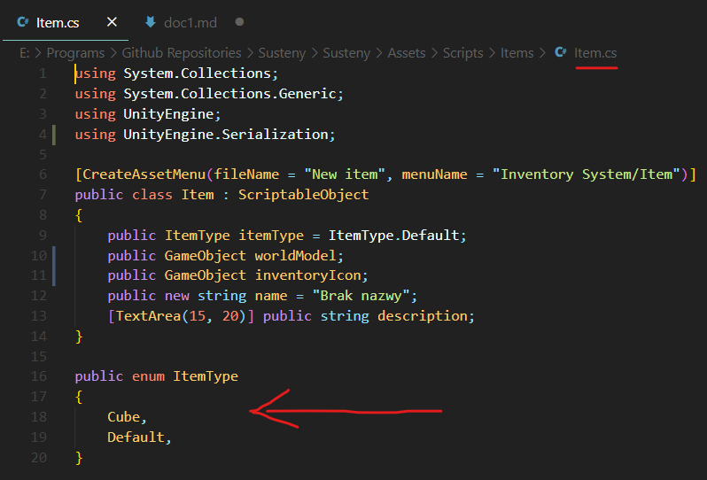

Na tej stronie opisany jest proces tworzenia przedmiotów, które gracz będzie mógł podnosić lub po prostu posiadać w ekwipnuku.

Po pierwsze należy stworzyć specjalny Scriptable Object w assetach, najlepiej w odpowiednim folderze, można to zrobić klikając prawym przyciskiem myszki na folderze -> Create -> Inventory system -> Item

Utworzy nam to bazę pod przedmiot.

Asset nazywamy jak chcemy, nazwa ta nie będzie widoczna w grze.
Uzupełniamy odpowiednie informacje o przedmiocie:

1. Item type - służy do identyfikacji itemu w kodzie.

Np. gdy potrzebujemy określonego klucza do drzwi, które znajdują się w piwnicy, można dodać typ **BasementKey**, a następnie sprawdzić, czy gracz posiada przedmiot o tym typie.

Aby dodać nowy typ, trzeba ręcznie dodać go w skrypcie Item, w enumie ItemType:

:::note
Jest to dość nieefektywny sposób na identyfikację kolejnych itemów (trzeba ręcznie dodawać nowe typy w kodzie, typy są globalne dla wszystkich leveli, musimy przeszukać cały ekwipunek w poszukiwaniu jednego przedmiotu) dlatego najprawdopodobniej zmienimy ten system.
:::

2. Kolejną rzeczą jest World Model. Jest to model przedmiotu oglądanego z ekwipunku gracza.

:::warning
Nie jest to ten sam model przedmiotu, który oglądamy, klikając na przedmiot w świecie gry! Być może ulegnie to zmianie, ale na razie nie jest to planowane (gdybyśmy jednak postanowili to zrobić, World Model byłby prawdopodobnie używany w obu przypadkach).
:::

3. Inventory icon - mówi samo za siebie, ikonka przedmiotu, która pojawi się w ekwipunku gracza.

4. Name, Description - nazwa oraz opis przedmiotu.
Na razie nie są nigdzie pokazywane. Docelowo będą się one wyświetlały w ekwipunku.

Aby umieścić nasz przedmiot na scenie, i a by mógł być on podnoszony / oglądany, należy stworzyć tak zwany element interaktwyny.

Instrukcja jak to zrobić znajduje się tutaj: [Tworzenie elementów interaktywnych](interactables)